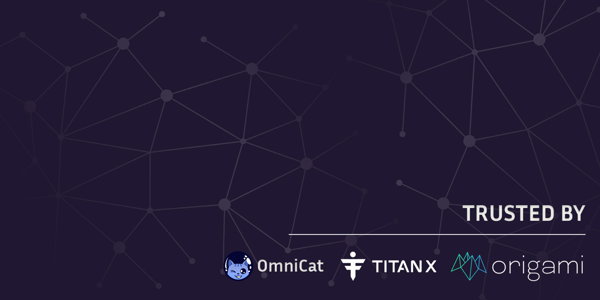

 

## SBSecurity Audit Portfolio

[**sbsecurity.net**](https://sbsecurity.net/)

If you have any questions or are seeking a security review for your project, reach out us at:

- Twitter - [**Slavcheww**](https://twitter.com/Slavcheww) / [**Blckhv**](https://twitter.com/blckhv)
- Telegram - [**Slavcheww**](https://t.me/Slavcheww) / [**Blckhv**](https://t.me/Blckhv)
- Discord - [**Slavcheww**](https://discordapp.com/users/263383171058499585) / [**Blckhv**](https://discordapp.com/users/215564246786768896)

## DeFi

| **Protocol** | Report | Description |
|-----------------|----------------|------------------|
|[Origami Finance](https://origami.finance/) | [Report](/reports/Origami-Security-Review.pdf) | ERC-4626 Vault powered by SKY vaults and CoWProtocol -  |
|[RootsFi](https://rootsfi.com/) | [Report](/reports/RootsFi-Security-Review.pdf) | CDP Stablecoin -  |
|[CrediFi](https://www.credi.fi/) | [Report](/reports/Credifi-Security-Review.pdf) | Onchain credit protocol -  |
|[OmniNFT](https://www.omnicat.xyz/) | [Report #1](/reports/OmniNFT-Security-Review.pdf), [Report #2](/reports/OmniNFT-Second-Security-Review.pdf) | Cross-chain NFT |
|[fMoney Market](https://www.fmoney.market/lending) | [Report](/reports/fMoney-Security-Review.pdf) | CompoundV2 fork	 |
|[Mizuchi]() | [Report](/reports/Mizuchi-Security-Review.pdf) | Perpetual Auctions |
|[LiquidLoot](https://www.liquidloot.io/) | [Report](/reports/LiquidLoot-Points-OTC-Security-Review.pdf) | Points Marketplace -  |
|[HyperLink](https://hyperlink.xyz/) | Findings: 1 High / 4 Medium | TEE Trading Platform with signer key rotation -  |
|REDACTED | Findings: 1 Critical / 7 High / 9 Medium | MSTR stock tokenization |
|[Cabal](https://thecabal.xyz/) | Findings: 11 Low | iUSD Asynchronous Yield Vault on top of Echelon|
|[Cabal](https://thecabal.xyz/) | Findings: 6 Medium | Delta Neutral Vault on top of Echelon -  |

## Staking/Restaking

| **Protocol** | Report | Description |
|-----------------|----------------|------------------|
|[Zero-G Finance](https://zerog.finance/) | [Report](/reports/Zero-G-Finance-Security-Review.pdf) | Liquid Restaking |
|[EnderProtocol](https://www.enderprotocol.io/) | [Report](/reports/Ender-Protocol-Security-Review.pdf) | Bonds/Liquid Staking |
|[CryptoCrritters(OctoStake)](https://cryptocritters.meme/) | [Report](/reports/CryptoCritters-(OctoStake)-Security-Review.pdf) | Staking |
|[Helios Staking V2](https://app.helios.win/) | [Report](/reports/HeliosStakingV2-Security-Review.pdf) | Staking |
|[BeeBribes](https://www.lavenderfive.com/blog/permissionless-market-for-berachain-liquidity-incentives) | [Report](/reports/BeeBribes-Security-Review.pdf) | Community Staking -  |

## Tokens/Asset Managments
| **Protocol** | Report | Description |
|-----------------|----------------|------------------|
| REDACTED | Findings: 2 Crit / 5 High / 3 Medium | [Cyfrin] RWA Lending Protocol -  |
|[Mentorable](https://www.mentorable.xyz/) | Findings: 1 Crit / 2 High / 3 Medium | Bonding Curve Token launchpad |
|[BuilDefi](https://buildefi.win/) | [Report](/reports/BuilDefi-Security-Review.pdf) | Custom memetoken launchpad with UniswapV4, UniswapV3 and Aave integrations |
|[Neko.hl](https://www.neko.fun/) | [Report](/reports/Neko.hl%20-%20Security%20Review.pdf) | MorphoV2 Fork, Asset Management -  |
|[Shift Protocol](https://shiftprotocol.xyz/) | [Report](/reports/ShiftProtocol-Security-Review.pdf) | ERC4626, Asset Management |
|[Element280](https://docs.helios-hlx.win/element280) | [Report #1](/reports/Element280-Security-Review.pdf) | ERC20, NFT, BuyAndBurn aggregating other ecosystem tokens |
|[S88, E280, H420, B88](https://docs.helios-hlx.win/element280) | [Report #1](/reports/Omnichain-Security-Review.pdf), [Report #2](/reports/H420-Security-Review.pdf), [Report #3](/reports/E280-NFT-Security-Review.pdf), [Report #4](/reports/E280-BNB-Security-Review.pdf) | LayerZero V2 OFT tokens |
|[Kettle.Shop](https://kettle.shop/) | [Report](/reports/Kettle-Mystery-Box-Security-Review.pdf) | Soulbound NFT mystery boxes	-  |
|[TempleDao - TPI Drip](https://templedao.link/) | [Report](/reports/TempleDao-TPI-Security-Review.pdf) | Token Treasury, Price Index |
|[Voyage](https://voyage.gitbook.io/voyage) | [Report](/reports/Voyage-Security-Review.pdf) | ERC20, Staking, Vesting, Vaults |
|[AlienX](https://xlr8r-build.gitbook.io/alienx) | [Report](/reports/AlienX-Security-Review.pdf) | ERC20, BuyAndBurn |
|[SCALE](https://zibars-organization.gitbook.io/scale) | [Report](/reports/SCALE-Security-Review.pdf) | ERC20, Reflection token, BuyAndBurn aggregating other ecosystem tokens built on DragonX |
|[Lotus](https://docs.lotus.win/) | [Report](/reports/Lotus-Security-Review.pdf) | ERC20, BuyAndBurn, Staking with custom rewards |
|[Eden](https://eden-2.gitbook.io/eden) | [Report](/reports/Eden-Security-Review.pdf) | ERC20, BuyAndBurn, Staking with custom rewards |
|[FeliX](https://felix-protocol.gitbook.io/) | [Report](/reports/FeliX-Security-Review.pdf) | ERC20, BuyAndBurn, NFT, Randomized rewards |
|[Uranus](https://uranus28.win/) | [Report](/reports/Uranus-Security-Review.pdf) | Memecoin with reflections |
|[SmokeRing](https://uranus28.win/) | [Report #1](/reports/Smoke-Ring-Security-Review.pdf), [Report #2](/reports/Smoke-Ring-OFT-Security-Review.pdf) | Memecoin with reflections |
|[Stax](https://element280.win/) | [Report](/reports/Stax-Security-Review.pdf) | ERC20, NFT, Staking aggregating other ecosystem stakings |
|[AwesomeX Hybrid NFT](https://docs.awesomex.win/awesomex-hybrid-nfts/awesomex-hybrid-nfts) | [Report](/reports/AwesomeX-Hybrid-NFT-Security-Review.pdf) | NFT |
|[Element369](https://docs.helios-hlx.win/element-369) | [Report](/reports/Element369-Security-Review.pdf) | NFT, Auction |
|[JakeX Universe](https://www.jakex.win/) | [Report](/reports/JakeXUniverse-Security-Review.pdf) | NFT |
|[Janus PLS](https://docs.helios-hlx.win/helios/additional-projects/janus) | [Report](/reports/Janus-PLS-Security-Review.pdf) | Token distribution |
|[Titan Legends](https://www.titanlegends.win/) | [Report #1](/reports/Titan%20Legends-Warlords-Security-Review.pdf), [Report #2](/reports/TitanLegends-BnB-Security-Review.pdf) | JakeX Backed NFT |
|[Sparta](https://www.spartapls.com) | [Report](/reports/Sparta-Security-Review.pdf) | ERC20 |
|[Diamonds](https://diamonds1111.win) | [Report](/reports/Diamonds-Security-Review.pdf) | Mining token with custom TWAP UniswapV2 oracle |
|[VeeFriends](https://veefriends.com/) | [Report](/reports/VeeFriends-Security-Review.pdf) | [Cyfrin] Custom ERC721C with creator policies |

## Others
| **Protocol** | Report | Description |
|-----------------|----------------|------------------|
|[Venus Periphery](https://venus.io/) | Findings: 5 Lows | Swap Router |
|[Cue](https://cue.market/) | [Report](/reports/Cue-Security-Review.pdf) | Options Betting -  |
|[Gacha](https://pull.gacha.game/) | [Report](/reports/Gacha-Security-Review.pdf) | Gamified Collectibles Marketplace -  |
|[Click.Game](https://fairplay.trade/) | [Report](/reports/Fairplay%20-%20Security%20Review.pdf) | Minesweeper -  |
|[Tierra](https://www.tierra.live/) | [Report](/reports/Tierra-Security-Review.pdf) | Fundraising -  |
|[LiquidMint](https://liquidmint.xyz/) | [Report](/reports/LiquidMint-Security-Review.pdf) | Diamond proxy, NFT renting -  |
|[Lila Finance](https://www.lila.finance/) | [Report](/reports/Lila-Finance-Report.pdf) | Yield Farm |

### Public Competitions

| **Protocol** | Type | Date | Ranking |
|-----------------|:----------------:|:------------------:|:------------------------:|
|[Recall](https://code4rena.com/audits/2025-02-recall) | Stableswap | February 2025 | 🥈 |
|[Thorn](https://app.hats.finance/audit-competitions/thorn-protocol-0x1286ecdac50215a366458a14968fbca4bd95067d/leaderboard) | Stableswap | October 2024 | 4th |
|[ZetaChain](https://cantina.xyz/competitions/80a33cf0-ad69-4163-a269-d27756aacb5e) | Interoperability protocol | August 2024 | 5th |
|[Zaros](https://codehawks.cyfrin.io/c/2024-07-zaros) | Perps | July 2024 | 6th |
|[Fenix Finance](https://www.fenixfinance.io/) | Liquidity Marketplace | July 2024 | 🥈 |
|[Badger eBTC](https://code4rena.com/audits/2024-06-ebtc-zap-router) | CDP | June 2024 | 5th |
|[Venus Governance](https://cantina.xyz/competitions/ddf86a5c-6f63-430f-aadc-d8742b4b1bcf) | LayerZero module | March 2024 | 🥇 |
|[Ethereum Credit Guild](https://code4rena.com/audits/2023-12-ethereum-credit-guild) | Lending/Borrowing/Staking | December 2023 | 8th |
|[Kelp DAO](https://code4rena.com/audits/2023-11-kelp-dao-rseth) | Liquid Restaking | November 2023 | 5th |

And over 40 more contests 
