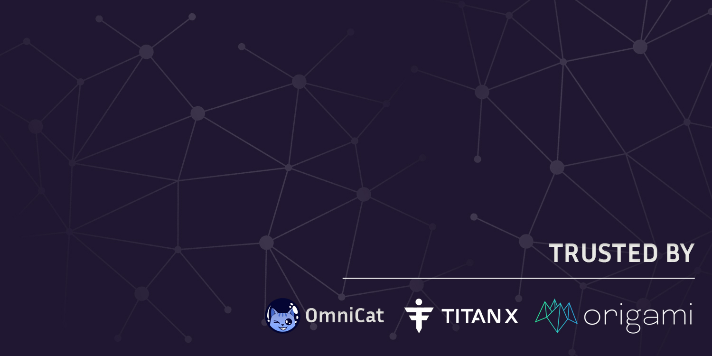

 

## SBSecurity Audit Portfolio

*Security reviews for teams that can't afford a hack.*

We're built for long-term security partnerships, not one-off audits — 80% of our clients come back for more. We serve DeFi protocols at every stage and scale.

- Manual Audits, AI-Superpowered
- Architectural Reviews
- Formal Verification
- Retainers with unlimited reviews — 2+ senior auditors available 24/7
- Web2 Audits with OpSec / Pentesting emphasis

If you have any questions or are seeking a security review for your project, reach out us at:

- Website - [**sbsecurity.net**](https://sbsecurity.net/)
- Twitter - [**Slavcheww**](https://twitter.com/Slavcheww) / [**Blckhv**](https://twitter.com/blckhv)
- Telegram - [**Slavcheww**](https://t.me/Slavcheww) / [**Blckhv**](https://t.me/Blckhv)
- Discord - [**Slavcheww**](https://discordapp.com/users/263383171058499585) / [**Blckhv**](https://discordapp.com/users/215564246786768896)

## What Clients Say

  <table>
  <tr>
  <td width="50%" valign="top">

  *"Across multiple audits with SBSecurity, the experience has consistently been smooth and on-schedule. The team is efficient, highly competent, and friendly — and we've been very happy with the process every time."*

  **— [0xSigmoid](https://x.com/0xSigmoid)** · Core Team at [Cabal](https://x.com/CabalFDN)

  </td>
  <td width="50%" valign="top">

  *"It is a rare thing to find a team that moves with both speed and precision. Working with you was enjoyable and consistently reliable. An excellent experience end to end."*

  **— [Near](https://x.com/Nearisbuilding)** · CTO at [Mentorable](https://x.com/mentorablehq)

  </td>
  </tr>
  <tr>
  <td width="50%" valign="top">

  *"They are proactive, passionate, and precise — consistently supporting you before, during, and after the audit. What we appreciated most was the feeling of a true collaboration rather than a 'you paid for an audit, now it's over' relationship."*

  **— [Hyper0x0](https://x.com/hyper0x0)** · CTO at [Shift Protocol](https://x.com/shiftprotocol_)

  </td>
  <td width="50%" valign="top">

  *"Provided a lot of context and took input from us to define the true risks. Went into depth distinguishing 'chain' versus 'dApp' problems — helpful for the overall report. Iteration was fast and without hassle."*

  **— [Ertemann](https://x.com/ertemann)** · CSO at [Lavender Five](https://x.com/lavender_five)

  </td>
  </tr>
  <tr>
  <td width="50%" valign="top">

  *"SB's background in audit competitions is evident in their speed, persistence, and attention to detail. The auditors have strong opinions on how code should be implemented and know what they are talking about — and they are not afraid to dive into new things to bring fresh 
  insights to an audit."*

  **— [Lux](https://x.com/luxaverse)** · CTO at [Origami Finance](https://x.com/origami_fi)

  </td>
  <td width="50%" valign="top">

  *"Great team to work with, exceptionally fast turnaround. Will be working together again."*

  **— [Winny](https://x.com/winternet)** · Founder of [Cue](https://x.com/cuedotfun)

  </td>
  </tr>
  </table>

## Lending, Stablecoins & Credit

| **Protocol** | Report | Description | Details |
|-----------------|----------------|------------------|------------------|
|[CrediFi](https://www.credi.fi/) | [Report](/reports/Credifi-Security-Review.pdf) | Onchain unsecured credit protocol issuing fixed-rate crypto loans |   |
|[fMoney Market](https://www.fmoney.market/lending) | [Report](/reports/fMoney-Security-Review.pdf) | Compound V2-fork money market with cToken-based supply, borrow, and liquidation logic |  |
|[Buck](https://buck.io/) | [Report](/reports/Buck-Security-Review.pdf) | Yield-bearing savings token backed by Strategy (MSTR) STRC perpetual preferreds, redeeming to USD-pegged unit |  |
|[RootsFi](https://rootsfi.com/) | [Report](/reports/RootsFi-Security-Review.pdf) | CDP minting MEAD stablecoin against BGT-earning Berachain LP collateral, preserving Proof-of-Liquidity rewards |   |
|[Firm Money](https://rootsfi.com/) | [Report](/reports/Firm-Money-Security-Review.pdf) | Liquity V2 fork minting USF stablecoin against ETH and SNT dual collateral; native CDP for Status L2 |  |
|REDACTED | 4 Audits | Top-4 stablecoin: vesting logic, Securitize-backed RWA issuance, and Dolomite-locked staked-stablecoin reward loop |  |
|[STBL](https://www.stbl.com/) | [Report](/reports/STBL-Stellar-V2-Security-Review.pdf) | Tokenized T-Bill RWA backing with principal/yield split: USST stablecoin + YLD yield-claim NFT (Soroban) |   |
|[M0](https://www.m0.org/) | Findings: 5 Low | M Portal bridge adapters routing $M stablecoin transfers over Wormhole NTT and Hyperlane messaging frameworks |  |

## Yield Vaults & Asset Management

| **Protocol** | Report | Description | Details |
|-----------------|----------------|------------------|------------------|
|[Origami Finance](https://origami.finance/) | [Report](/reports/Origami-Security-Review.pdf) | ERC-4626 auto-compounder wrapping Sky sUSDS savings, with CoW Protocol swap routing for reward harvesting |   |
|[Cabal](https://thecabal.xyz/) | [Report](/reports/Cabal-iUSD-Vault-Security-Review.pdf) | ERC-7540-style asynchronous deposit/redeem iUSD vault routing stablecoin liquidity into Echelon lending markets |  |
|[Cabal](https://thecabal.xyz/) | [Report](/reports/Cabal-DeltaNeutral-Security-Review.pdf) | Delta-neutral yield vault pairing Echelon borrow positions with perp shorts to hedge directional exposure |  |
|[Cabal](https://thecabal.xyz/) | [Report](/reports/Cabal-Strat-Vault-LST-Wrapper-Security-Review.pdf) | Move-based wrapper exposing Strat liquid-staking tokens as Echelon-compatible collateral |  |
|[Neko.hl](https://www.neko.fun/) | [Report](/reports/Neko.hl%20-%20Security%20Review.pdf) | Morpho V2 fork on Hyperliquid: curated vaults route BTC/ETH/HYPE across HyperCore, Morpho and Pendle strategies |   |
|[Neko.hl OVault](https://www.neko.fun/) | [Report](/reports/Neko.hl%20OVault%20-%20Security%20Review.pdf) | LayerZero OVault wrapper over the Hyperliquid Morpho V2 fork; ERC-4626 shares mintable from any chain |   |
|[Shift Protocol](https://shiftprotocol.xyz/) | [Report](/reports/ShiftProtocol-Security-Review.pdf) | ERC-4626 vault aggregating curated yield strategies with single-token deposit and share-based accounting |  |
|[Shift Protocol V2](https://shiftprotocol.xyz/) | [Report](/reports/Shift-V2-Security-Review.pdf) | Asynchronous ERC-4626 vault with modular strategy adapters and curator-managed allocation |  |
|[Shift Protocol V2](https://shiftprotocol.xyz/) | [Report](/reports/Shift-V2-Cairo-Security-Review.pdf) | Cairo port of the Shift V2 asynchronous ERC-4626 vault on Starknet |  |
|[Voyage](https://voyage.gitbook.io/voyage) | [Report](/reports/Voyage-Security-Review.pdf) | Automated yield-farming aggregator: ERC-20 token with staking, vesting schedules and managed strategy vaults |  |
|[TempleDao - TPI Drip](https://templedao.link/) | [Report](/reports/TempleDao-TPI-Security-Review.pdf) | Treasury Price Index oracle that linearly drips TEMPLE backing toward a DAO-set target, anchoring TLC borrow/liquidation |  |
|[Lila Finance](https://www.lila.finance/) | [Report](/reports/Lila-Finance-Report.pdf) | Interest-rate swap protocol splitting yield-bearing positions into fixed and floating rate legs (Arbitrum) |  |

## DEX, Perps & Trading Infra

| **Protocol** | Report | Description | Details |
|-----------------|----------------|------------------|------------------|
|[Venus](https://venus.io/) | [Report](/reports/Venus-Swap-Router-Security-Review.pdf) | Venus Core Pool SwapRouter aggregating BNB Chain liquidity to atomically swap-and-supply or repay vToken positions |  |
|[Mizuchi]() | [Report](/reports/Mizuchi-Security-Review.pdf) | Continuous on-chain auction primitive for permissionless token issuance and price discovery |  |
|[HyperLink](https://hyperlink.xyz/) | Findings: 1 High / 4 Medium | TEE-isolated trading frontend for Hyperliquid with rotatable session signer keys for non-custodial order flow |   |
|[LiquidLoot](https://www.liquidloot.io/) | [Report](/reports/LiquidLoot-Points-OTC-Security-Review.pdf) | Pre-TGE points OTC marketplace with on-chain order book, USDT collateral escrow, and post-TGE settlement |   |

## Staking & Restaking

| **Protocol** | Report | Description | Details |
|-----------------|----------------|------------------|------------------|
|[Zero-G Finance](https://zerog.finance/) | [Report](/reports/Zero-G-Finance-Security-Review.pdf) | Multichain EigenLayer LRT issuing zgETH, with Connext/CCTP cross-chain deposit routing from supported L2s |  |
|[EnderProtocol](https://www.enderprotocol.io/) | [Report](/reports/Ender-Protocol-Security-Review.pdf) | LST liquidity aggregator issuing endETH against time-locked ETH/LST bonds, with END as the stripped yield token |  |
|[CryptoCrritters(OctoStake)](https://cryptocritters.meme/) | [Report](/reports/CryptoCritters-(OctoStake)-Security-Review.pdf) | NFT staking vault locking ERC-721s to accrue ERC-20 emission rewards |  |
|[Helios Staking V2](https://app.helios.win/) | [Report](/reports/HeliosStakingV2-Security-Review.pdf) | Multi-asset I-PoSR staking on Helios L1, where validators collateralize HLX against bridged stablecoin and RWA deposits |  |
|[BeeBribes](https://www.lavenderfive.com/blog/permissionless-market-for-berachain-liquidity-incentives) | [Report](/reports/BeeBribes-Security-Review.pdf) | Permissionless Berachain bribe auction directing validator BGT emissions to reward vaults priced by daily bid share |   |

## NFTs, Games & Marketplaces

| **Protocol** | Report | Description | Details |
|-----------------|----------------|------------------|------------------|
|[VeeFriends](https://veefriends.com/) | [Report](/reports/VeeFriends-Security-Review.pdf) | ERC-721C collection enforcing on-chain creator-royalty policies via Limit Break's transfer-validator and operator allowlists |  |
|[OmniNFT](https://www.omnicat.xyz/) | [Report #1](/reports/OmniNFT-Security-Review.pdf), [Report #2](/reports/OmniNFT-Second-Security-Review.pdf) | LayerZero ONFT-based omnichain NFT collection using burn-and-mint messaging across seven EVM chains |  |
|[PsiFi](https://psifi.app/) | Findings: 3 Low | Payments-oriented ERC-721 minted lazily via EIP-712 signed vouchers, with ERC-1155 backed claim and settlement primitives |  |
|[AwesomeX Hybrid NFT](https://docs.awesomex.win/awesomex-hybrid-nfts/awesomex-hybrid-nfts) | [Report](/reports/AwesomeX-Hybrid-NFT-Security-Review.pdf) | Hybrid ERC-721 NFTs vaulting tiered $AWX (88.8M/888M/8.88B); burn-to-claim with 8% mint fee routed to treasury/launchpad |  |
|[Element369](https://docs.helios-hlx.win/element-369) | [Report](/reports/Element369-Security-Review.pdf) | Yield-bearing NFTs that auto-participate in Flux daily TitanX auctions and accrue E280/Inferno/Flux backing redeemable on burn |  |
|[JakeX Universe](https://www.jakex.win/) | [Report](/reports/JakeXUniverse-Security-Review.pdf) | TitanX-paired NFT collection within the JakeX Universe, leveraging TitanX price coupling and burn mechanics |  |
|[Titan Legends](https://www.titanlegends.win/) | [Report #1](/reports/Titan%20Legends-Warlords-Security-Review.pdf), [Report #2](/reports/TitanLegends-BnB-Security-Review.pdf) | Hybrid NFT/ERC-20 collection with two-way escrow swapping Titan Legends NFTs for $LGNDX, deflationary in both directions |  |
|[Kettle.Shop](https://kettle.shop/) | [Report](/reports/Kettle-Mystery-Box-Security-Review.pdf) | Tiered gachapon mystery-box NFTs redeemable for authenticated luxury watch RWAs, integrated with Berachain PoL |   |
|[Gacha](https://pull.gacha.game/) | [Report](/reports/Gacha-Security-Review.pdf) | Abstract-chain gamified collectibles marketplace selling randomized on-chain card/pack pulls over a vaulted inventory |   |
|[Click.Game](https://fairplay.trade/) | [Report](/reports/Fairplay%20-%20Security%20Review.pdf) | Abstract-chain provably-fair Minesweeper betting game with on-chain seed commitment and payout settlement |   |
|[Cue](https://cue.market/) | [Report](/reports/Cue-Security-Review.pdf) | Solana options-style prediction market for binary event contracts with on-chain settlement |   |
|[LiquidMint](https://liquidmint.xyz/) | [Report](/reports/LiquidMint-Security-Review.pdf) | Berachain Diamond-proxy protocol for NFT liquid backing, lending/borrowing, and rental against jpeg collateral |   |
|[Tierra](https://www.tierra.live/) | [Report](/reports/Tierra-Security-Review.pdf) | Berachain AI-DAO fundraising platform with AI-agent-compatible smart contracts (Bailoo) orchestrating raises and treasury flows |   |

## Tokens & Tokenomics Engines

| **Protocol** | Report | Description | Details |
|-----------------|----------------|------------------|------------------|
|[Element280](https://element280.win/) | [Report](/reports/Element280-Security-Review.pdf) | ELMNT token and NFT giving leveraged exposure to the TitanX ecosystem via LP bonds and BuyAndBurn flywheel |  |
|[S88, E280, H420, B88](https://element280.win/) | [Report #1](/reports/Omnichain-Security-Review.pdf), [Report #2](/reports/H420-Security-Review.pdf), [Report #3](/reports/E280-NFT-Security-Review.pdf), [Report #4](/reports/E280-BNB-Security-Review.pdf) | LayerZero V2 OFT deployments of Element ecosystem tokens enabling burn/mint omnichain transfers |  |
|[E280 ARB](https://element280.win/) | [Report](/reports/E280-ARB-Security%20Review.pdf) | Arbitrum deployment of E280 with GMX V2 perp-LP yield routed into protocol-owned BuyAndBurn |  |
|[E280 BNB](https://element280.win/) | [Report](/reports/E280-BNB-Security-Review.pdf) | BNB Chain deployment of E280 with chain-native LP bonds feeding the BuyAndBurn engine |  |
|[E280 NFT](https://element280.win/) | [Report](/reports/E280-NFT-Security-Review.pdf) | ERC-721 collection auto-accruing E280 buyback rewards, redeemable without staking and transferable with claim |  |
|[AlienX](https://xlr8r-build.gitbook.io/alienx) | [Report](/reports/AlienX-Security-Review.pdf) | Deflationary ERC-20 minted from TitanX over 8 weekly cycles; tax-funded BuyAndBurn converts TitanX into Inferno and burns AlienX |  |
|[SCALE](https://zibars-organization.gitbook.io/scale) | [Report](/reports/SCALE-Security-Review.pdf) | Reflection ERC-20 in the DragonX/Baby DragonX HQ ecosystem with BuyAndBurn aggregating TitanX-network tokens |  |
|[Lotus](https://docs.lotus.win/) | [Report](/reports/Lotus-Security-Review.pdf) | TitanX/Volt-based virtual-mining ERC-20 with decentralized BuyAndBurn and tiered staking emitting TitanX rewards |  |
|[Eden](https://eden-2.gitbook.io/eden) | [Report](/reports/Eden-Security-Review.pdf) | Hyper-deflationary TitanX virtual-mining ERC-20; tiered stakes earning TitanX, auto-compound, Lotus 1:1 migration sink |  |
|[FeliX](https://felix-protocol.gitbook.io/) | [Report](/reports/FeliX-Security-Review.pdf) | Deflationary ERC-20 with VRF-driven BlackBox rewards, X28-paired Magic Pool burns, and time-limited Minter NFTs |  |
|[Sparta](https://www.spartapls.com) | [Report](/reports/Sparta-Security-Review.pdf) | Hyper-deflationary PulseChain ERC-20 with 5% buy/sell tax routed to LP and burns; HEX-paired for Heart's-Law beta |  |
|[Diamonds](https://diamonds1111.win) | [Report](/reports/Diamonds-Security-Review.pdf) | Mining token priced via a custom UniswapV2 TWAP oracle gating mint costs and reward emissions |  |
|[Uranus](https://uranus28.win/) | [Report](/reports/Uranus-Security-Review.pdf) | PulseChain reflection memecoin distributing buy/sell taxes to holders in the pair token |  |
|[SmokeRing](https://uranus28.win/) | [Report #1](/reports/Smoke-Ring-Security-Review.pdf), [Report #2](/reports/Smoke-Ring-OFT-Security-Review.pdf) | PulseChain reflection memecoin redistributing transaction taxes to holders via the Uranus28 ecosystem |  |
|[Stax](https://element280.win/) | [Report](/reports/Stax-Security-Review.pdf) | NFT vault aggregating staking positions across Element280 ecosystem tokens and streaming rewards to holders |  |
|[Janus PLS](https://docs.helios-hlx.win/helios/additional-projects/janus) | [Report](/reports/Janus-PLS-Security-Review.pdf) | Helios-ecosystem token distribution contract orchestrating multi-token claim/airdrop flows on PulseChain |  |
|[Vernal]() | [Report](/reports/Vernal-Security-Review.pdf) | USDS-collateralized ERC-20 with on-chain backing redemption against Sky Protocol's USDS |  |
|[GoldMine]() | [Report](/reports/GoldMine-Security-Review.pdf) | Mining-style ERC-20 with XAUt (Tether Gold) integrated buyback, anchoring token backing to tokenized physical gold |  |
|[Mentorable](https://www.mentorable.xyz/) | Findings: 1 Crit / 2 High / 3 Medium | Bonding-curve launchpad for tokenized mentor access |  |
|[BuilDefi](https://buildefi.win/) | [Report](/reports/BuilDefi-Security-Review.pdf) | Memecoin launchpad routing liquidity through Uniswap V4 hooks and V3 pools, with Aave-collateralized treasury |  |

## Governance

| **Protocol** | Report | Description | Details |
|-----------------|----------------|------------------|------------------|
|[ENS DAO](https://ensdao.org/) | Findings: 3 Low | OpenZeppelin Governor + 2-day Timelock executing on-chain ENS proposals, with Security Council cancel rights |  |

### Public Competitions

| **Protocol** | Type | Date | Ranking |
|-----------------|:----------------:|:------------------:|:------------------------:|
|[Venus Governance](https://cantina.xyz/competitions/ddf86a5c-6f63-430f-aadc-d8742b4b1bcf) | LayerZero module | March 2024 | 🥇 |
|[Fenix Finance](https://www.fenixfinance.io/) | Liquidity Marketplace | July 2024 | 🥇 |
|[Recall](https://code4rena.com/audits/2025-02-recall) | Stableswap | February 2025 | 🥈 |
|[Thorn](https://app.hats.finance/audit-competitions/thorn-protocol-0x1286ecdac50215a366458a14968fbca4bd95067d/leaderboard) | Stableswap | October 2024 | 4th |
|[ZetaChain](https://cantina.xyz/competitions/80a33cf0-ad69-4163-a269-d27756aacb5e) | Interoperability protocol | August 2024 | 5th |
|[Badger eBTC](https://code4rena.com/audits/2024-06-ebtc-zap-router) | CDP | June 2024 | 5th |
|[Kelp DAO](https://code4rena.com/audits/2023-11-kelp-dao-rseth) | Liquid Restaking | November 2023 | 5th |
|[Zaros](https://codehawks.cyfrin.io/c/2024-07-zaros) | Perps | July 2024 | 6th |

And over 40 more contests 

## Book a Review

Building something that needs a careful set of eyes? Reach out — we typically respond within 12 hours.

### → [Request an audit](https://www.sbsecurity.net/request-audit)

Or reach out directly:

- Twitter — [Slavcheww](https://twitter.com/Slavcheww) · [Blckhv](https://twitter.com/blckhv)
- Telegram — [Slavcheww](https://t.me/Slavcheww) · [Blckhv](https://t.me/Blckhv)
- Discord — [Slavcheww](https://discordapp.com/users/263383171058499585) · [Blckhv](https://discordapp.com/users/215564246786768896)
