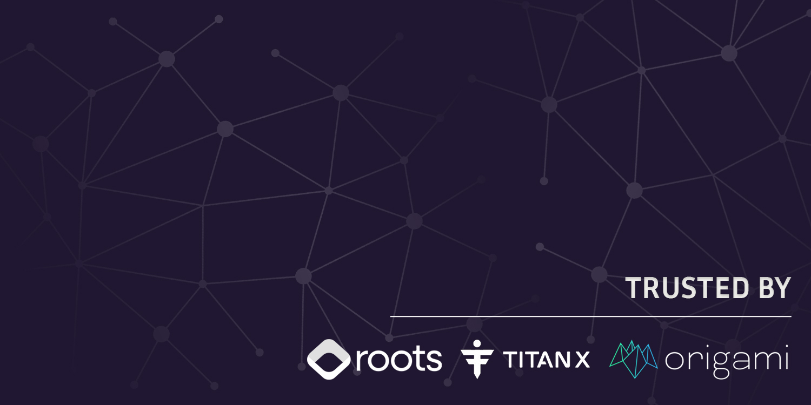

    

For comprehensive details about our offerings, achievements, team, and more, feel free to explore our website - [**sbsecurity.net**](https://sbsecurity.net/)

## About us

We are a duo of experienced smart contract researchers, dedicated to becoming leaders in the field by providing the best security services possible. We have achieved multiple top places on Code4rena, uncovering over 230 H/M severity vulnerabilities across 40+ audits.

## Book us

If you have any questions or are seeking a security review for your project, feel free to contact us at:

- Twitter - [**Slavcheww**](https://twitter.com/Slavcheww) / [**Blckhv**](https://twitter.com/blckhv)
- Telegram - [**Slavcheww**](https://t.me/Slavcheww) / [**Blckhv**](https://t.me/Blckhv)
- Discord - [**Slavcheww**](https://discordapp.com/users/263383171058499585) / [**Blckhv**](https://discordapp.com/users/215564246786768896)

## Our Work

### Private Engagements

|  | **Protocol** | Type | Report | Date |
|:--:|-----------------|:----------------:|:------------------:|:------------------------:|
| 39|[Soon](/) | Asset Management, Euler integration | [Soon]() | June 2025 |
| 38|[E280-BSC](/) | NFT, LP Injector | [Report](/reports/private/E280-BNB-Security-Review.pdf) | June 2025 |
| 37|[SmokeRing-OFT](/) | Memecoin with reflections - OFT version | [Report](/reports/private/Smoke-Ring-OFT-Security-Review.pdf) | June 2025 |
| 36|[Kettle.Shop](https://kettle.shop/) | Soulbound NFT mystery boxes | [Report](/reports/private/Kettle-Mystery-Box-Security-Review.pdf) | June 2025 |
| 35|[E280 NFT](https://element280.win/) | Element280's ONFT built with LayerZero | [Report](/reports/private/E280-NFT-Security-Review.pdf) | May 2025 |
| 34|[Tierra](https://www.tierra.live/) | Fundraising | [Report](/reports/private/Tierra-Security-Review.pdf) | April 2025 |
| 34|[SmokeRing](https://uranus28.win/) | Memecoin with reflections | [Report](/reports/private/Smoke-Ring-Security-Review.pdf) | April 2025 |
| 33|[H420 BnBV2](https://helios.win/) | BuyBurn Module | [Report](/reports/private/H420-Security-Review.pdf) | April 2025 |
| 32|[RootsFi](https://rootsfi.com/) | CDP Stablecoin on Berachain | [Report](/reports/private/RootsFi-Security-Review.pdf) | March 2025 |
| 31|[S88, E280, H420, B88](https://element280.win/) | LayerZero V2 OFT tokens | [Report](/reports/private/Omnichain-Security-Review.pdf) | March 2025 |
| 30|[BeeBribes](https://www.lavenderfive.com/blog/permissionless-market-for-berachain-liquidity-incentives) | Berachain Community Staking | [Report](/reports/private/BeeBribes-Security-Review.pdf) | March 2025 |
| 29|[Sparta]() | ERC20 | [Report](/reports/private/Sparta-Security-Review.pdf) | February 2025 |
| 28|[Uranus](https://uranus28.win/) | Memecoin with reflections | [Report](/reports/private/Uranus-Security-Review.pdf) | February 2025 |
| 27|[fMoney Market](https://www.fmoney.market/lending) | CompoundV2 fork | [Report](/reports/private/fMoney-Security-Review.pdf) | January 2025 |
| 26|[Helios Staking V2](https://app.helios.win/) | Staking | [Report](/reports/private/HeliosStakingV2-Security-Review.pdf) | January 2025 |
| 25|[Mizuchi]() | TitanX Perpetual Auctions | [Report](/reports/private/Mizuchi-Security-Review.pdf) | December 2024 |
| 24|[LiquidMint](https://liquidmint.xyz/) | Diamond proxy, NFT renting | [Report](/reports/private/LiquidMint-Security-Review.pdf) | December 2024 |
| 23|[LegendX BuyAndBurn](https://www.titanlegends.win/) | BuyAndBurn | [Report](/reports/private/TitanLegends-BnB-Security-Review.pdf) | December 2024 |
| 22|[Stax](https://element280.win/) | ERC20, NFT, Staking aggregating other ecosystem stakings | [Report](/reports/private/Stax-Security-Review.pdf) | November 2024 |
| 21|[AwesomeX Hybrid NFT](https://docs.awesomex.win/awesomex-hybrid-nfts/awesomex-hybrid-nfts) | NFT | [Report](/reports/private/AwesomeX-Hybrid-NFT-Security-Review.pdf) | November 2024 |
| 20|[Element369](https://docs.helios-hlx.win/element-369) | NFT, Auction | [Report](/reports/private/Element369-Security-Review.pdf) | November 2024 |
| 19|[FeliX](https://felix-protocol.gitbook.io/) | ERC20, BuyAndBurn, NFT, Randomized rewards | [Report](/reports/private/FeliX-Security-Review.pdf) | November 2024 |
| 18|[Eden](https://eden-2.gitbook.io/eden) | ERC20, BuyAndBurn, Staking with custom rewards | [Report](/reports/private/Eden-Security-Review.pdf) | November 2024 |
| 17|[JakeX Universe](https://www.jakex.win/) | NFT | [Report](/reports/private/JakeXUniverse-Security-Review.pdf) | November 2024 |
| 16|[TempleDao - TPI Drip](https://templedao.link/) | Token Treasury, Price Index | [Report](/reports/private/TempleDao-TPI-Security-Review.pdf) | October 2024 |
| 15|[Janus PLS](https://docs.helios-hlx.win/helios/additional-projects/janus) | Token distribution, Pulsechain | [Report](/reports/private/Janus-PLS-Security-Review.pdf) | October 2024 |
| 14|[Voyage](https://voyage.gitbook.io/voyage) | ERC20, Staking, Vesting, Vaults | [Report](/reports/private/Voyage-Security-Review.pdf) | October 2024 |
| 13|[Lotus](https://docs.lotus.win/) | ERC20, BuyAndBurn, Staking with custom rewards | [Report](/reports/private/Lotus-Security-Review.pdf) | October 2024 |
| 12|[SCALE](https://zibars-organization.gitbook.io/scale) | ERC20, Reflection token, BuyAndBurn aggregating other ecosystem tokens built on DragonX | [Report](/reports/private/SCALE-Security-Review.pdf) | October 2024 |
| 11|[AlienX](https://xlr8r-build.gitbook.io/alienx) | ERC20, BuyAndBurn | [Report](/reports/private/AlienX-Security-Review.pdf) | October 2024 |
| 10|[Titan Legends]() | JakeX Backed NFT | [Report](/reports/private/Titan%20Legends-Warlords-Security-Review.pdf) | October 2024 |
| 9 |[Origami](https://origami.finance/) | ERC-4626 Vault powered by SKY vaults and CoWProtocol | [Report](/reports/private/Origami-Security-Review.pdf) | September 2024 |
| 8 |[Element280](https://docs.helios-hlx.win/element280) | ERC20, NFT, BuyAndBurn aggregating other ecosystem tokens | [Report](/reports/private/Element280-Security-Review.pdf) | September 2024 |
| 7 |[YetiApes](https://www.yetiapes.xyz/) | DualToken Staking | Soon | September 2024 |
| 6 |[OmniNFT - Second Review](https://www.omnicat.xyz/) | Cross-chain NFT | [Report](/reports/private/OmniNFT-Second-Security-Review.pdf) | June 2024 |
| 5 |[OmniNFT](https://www.omnicat.xyz/) | Cross-chain NFT | [Report](/reports/private/OmniNFT-Security-Review.pdf) | June 2024 |
| 4 |[CryptoCrritters(OctoStake)](https://cryptocritters.meme/) | Staking | [Report](/reports/private/CryptoCritters-(OctoStake)-Security-Review.pdf) | June 2024 |
| 3 |[EnderProtocol](https://www.enderprotocol.io/) | Bonds/Liquid Staking | [Report](/reports/private/Ender-Protocol-Security-Review.pdf) | May 2024 |
| 2 |[Zero-G Finance](https://zerog.finance/) | Liquid Restaking | [Report](/reports/private/Zero-G-Finance-Security-Review.pdf) |	April 2024 |
| 1 |[Lila Finance](https://www.lila.finance/) | Yield Farm | [Report](/reports/private/Lila-Finance-Report.pdf) | February 2024 |

### Public Competitions

|    | **Protocol** | Type  | Date | Ranking |
|:--:|-----------------|:----------------:|:------------------:|:------------------------:|
| 9 |[Recall](https://code4rena.com/audits/2025-02-recall) | Stableswap | February 2025 | 🥈 |
| 8 |[Thorn](https://app.hats.finance/audit-competitions/thorn-protocol-0x1286ecdac50215a366458a14968fbca4bd95067d/leaderboard) | Stableswap | October 2024 | 4th |
| 7 |[ZetaChain](https://cantina.xyz/competitions/80a33cf0-ad69-4163-a269-d27756aacb5e) | Interoperability protocol | August 2024 | 5th |
| 6 |[Zaros](https://codehawks.cyfrin.io/c/2024-07-zaros) | Perps | July 2024 | 6th |
| 5 |[Fenix Finance](https://www.fenixfinance.io/) | Liquidity Marketplace | July 2024 | 🥈 |
| 4 |[Badger eBTC](https://code4rena.com/audits/2024-06-ebtc-zap-router) | CDP | June 2024 | 5th |
| 3 |[Venus Governance](https://cantina.xyz/competitions/ddf86a5c-6f63-430f-aadc-d8742b4b1bcf) | LayerZero module | March 2024 | 🥇 |
| 2 |[Ethereum Credit Guild](https://code4rena.com/audits/2023-12-ethereum-credit-guild) | Lending/Borrowing/Staking | December 2023 | 8th |
| 1 |[Kelp DAO](https://code4rena.com/audits/2023-11-kelp-dao-rseth) | Liquid Restaking | November 2023 | 5th |

And over 40 more contests 
